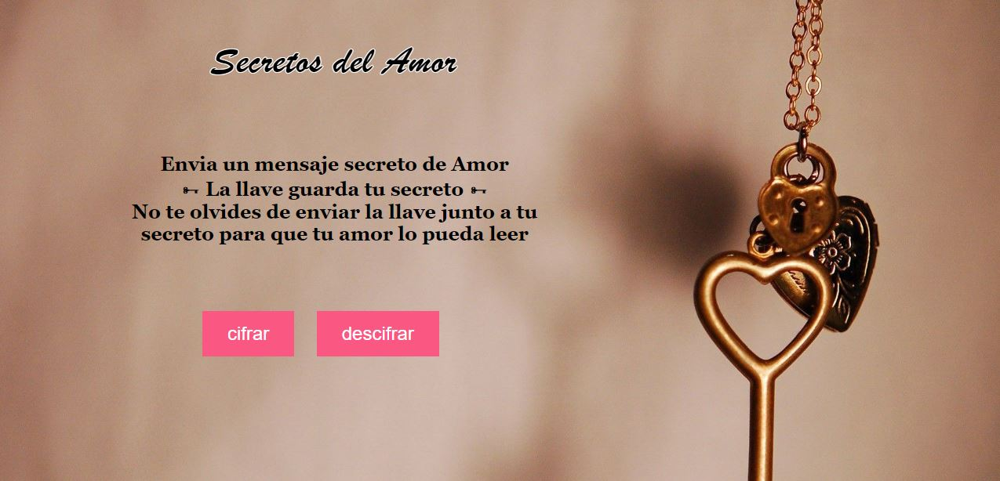
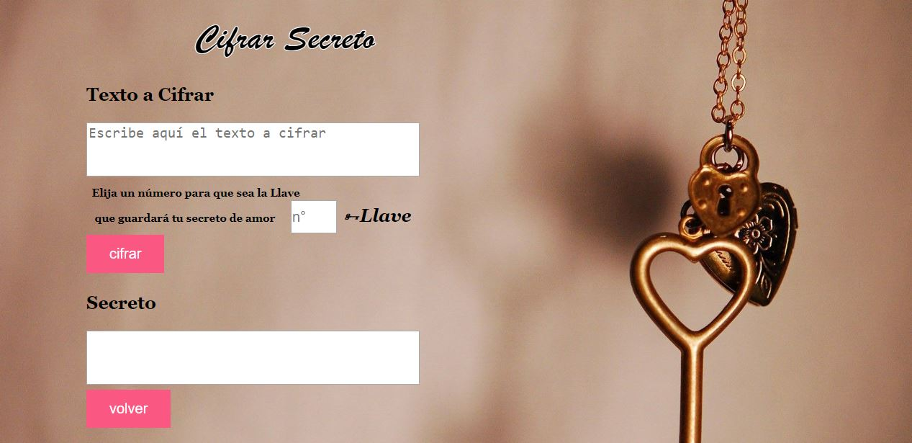
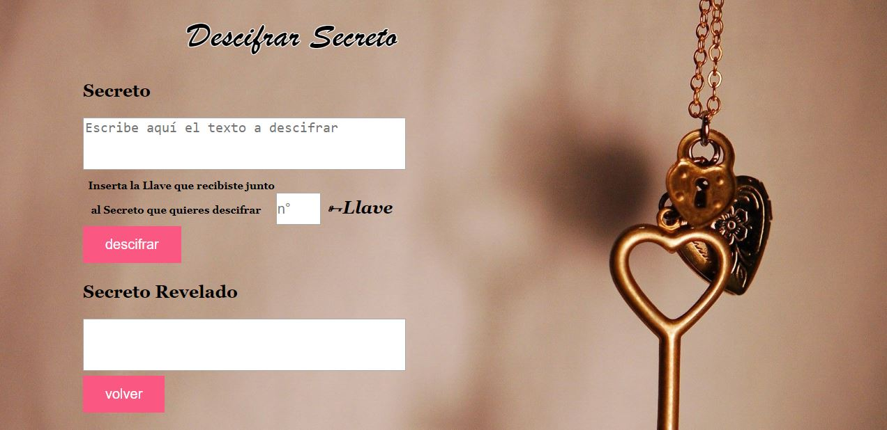
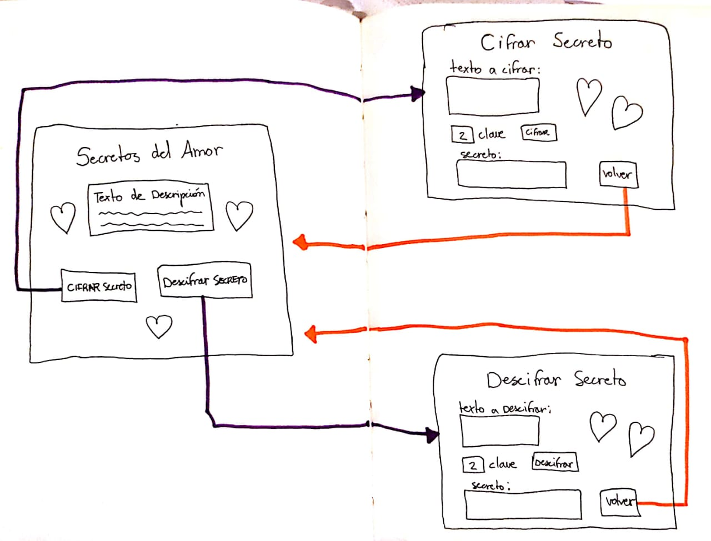
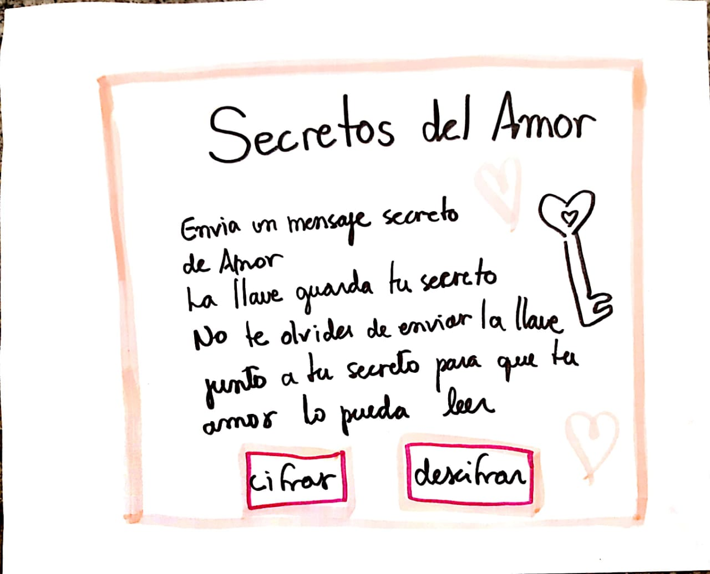
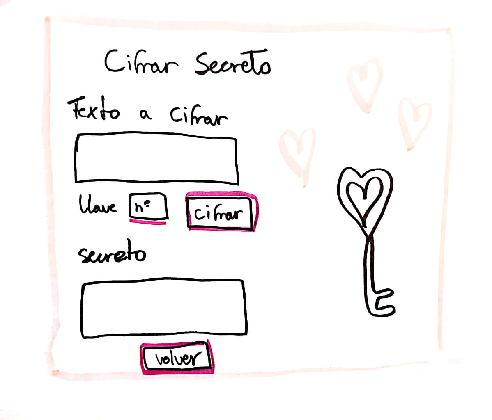
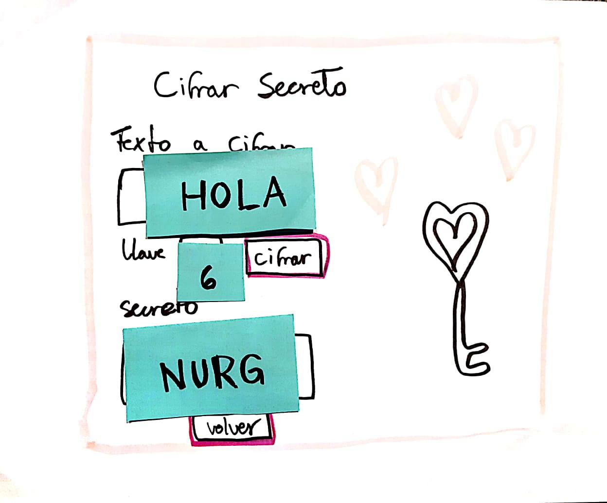
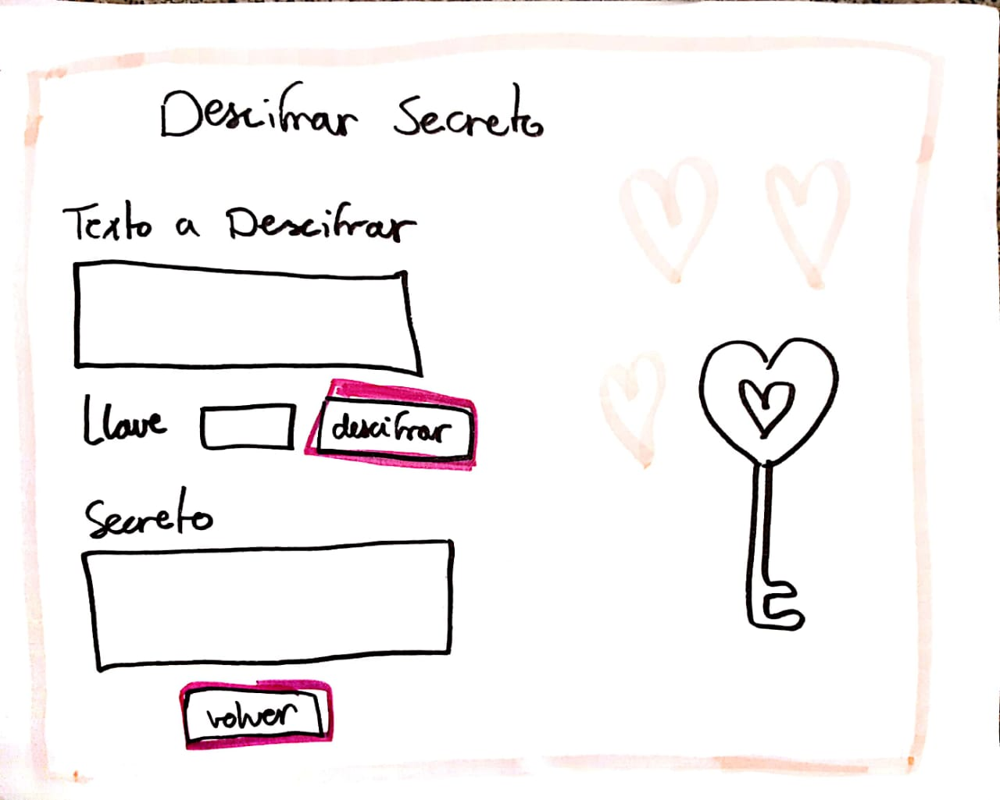
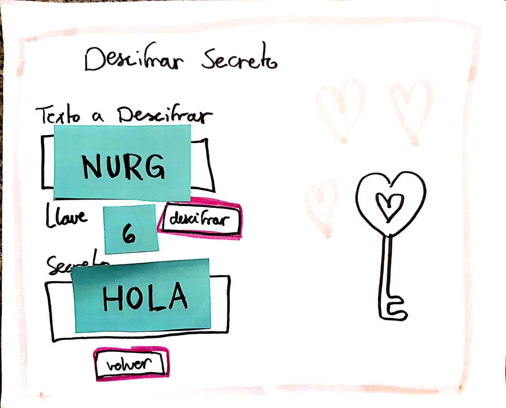

# Secretos del Amor
A veces queremos compartir mensajes o informaciones bastante privadas en las aplicaciones de mensajería instantanea o en las redes sociales. Pero, ¿Cómo dejarlos en secretos? Los mejores secretos son los que solamente son compartidos entre los enamorados y por eso es importante que esta información esté lo más segura posible.

Secretos del Amor es una aplicación web que permite a los enamorados más misteriosos *cifrar* y *descifrar* un mensaje y así convertir ese mensaje en un **Secreto** que solamente podrá ser revelado a la persona que posee la **Llave**. 

La *llave* es un número a tu elección que debe ser usado para cifrar un mensaje que se convertirá en secreto.

Trás haber cifrado el mensaje, puedes copiarlo y enviarlo a tu amor.

 La *llave* debe ser guardada y enviada junto al secreto, así solamente ustedes podrán conocer su contenido. Nadie más podrá saber lo que dicen en los *Secretos del Amor*!

***
## Características Principales

Secretos del Amor es basado en el cifrado César, un tipo de crifado por sustitución, es decir que cada letra del texto original es reemplazada por otra que se encuentra a un número fijo de posiciones (desplazamiento o *Llave*) más adelante en el mismo alfabeto.

La interfaz permite al usuario:

**Cifrar Secreto**
- **Texto a Cifra** - Insertar un mensaje (texto) a cifrar.
- **Llave** - Elegir un desplazamiento indicando cuántas posiciones queremos que el cifrado desplace cada caracter.
- **Secreto** - Convertir el texto en *Secreto*, es decir, en un texto cifrado.

**Descifrar Secreto**
- **Secreto** - Insertar un mensaje (texto) a descifrar.
- **Llave** - Ingresar el mismo número que fue elegido al momento del cifrado.
- **Secreto Revelado** - Ver el resultado del mensaje descifrado.

***
## Como acceder la aplicación

Para ir a la aplicación se puede acceder al seguiente link:

[https://gisellem22.github.io/SCL009-Cipher/src/index.html](https://gisellem22.github.io/SCL009-Cipher/src/index.html)
- 
***
## Implementado con

- JavaScript.
- HTML5.
- CSS.
***
## Decisiones de diseño
#### Diagrama de flujo

#### Prototipo de baja fidelidad

#### Tests de Usuario

Trás los tests de Usuario fueron agregados descripciones con más detalles a los campos de informaciones a ser ingresadas por el usuario para que la funcionalidad de cada elemento estuviera más clara.
[Video - User Test "Secretos del Amor"](https://www.youtube.com/watch?v=uJHNdyivZ68&feature=youtu.be)
